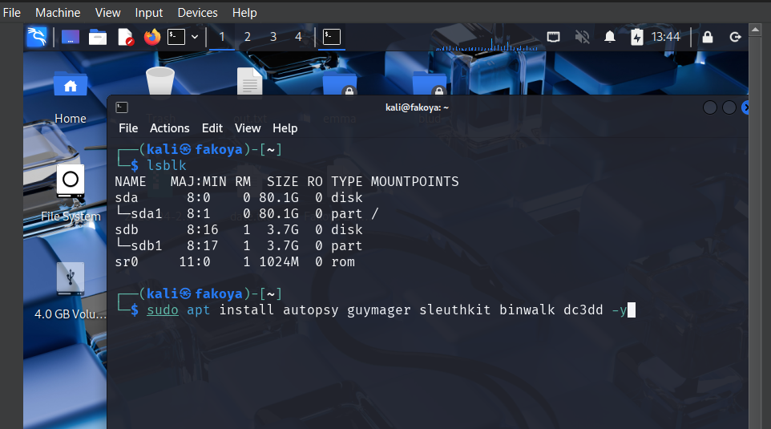
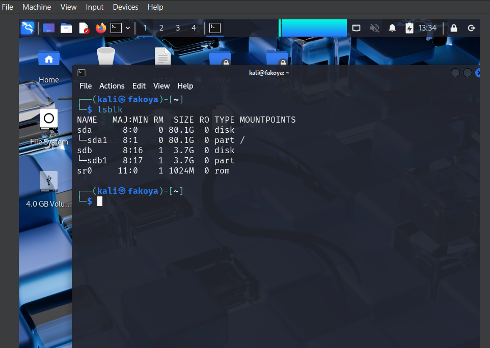
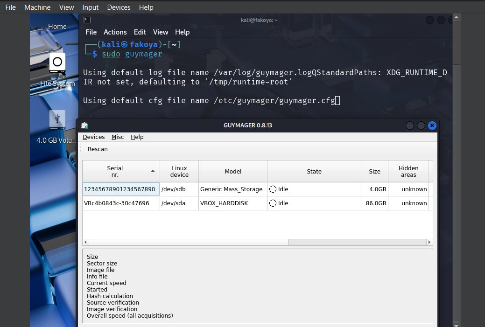
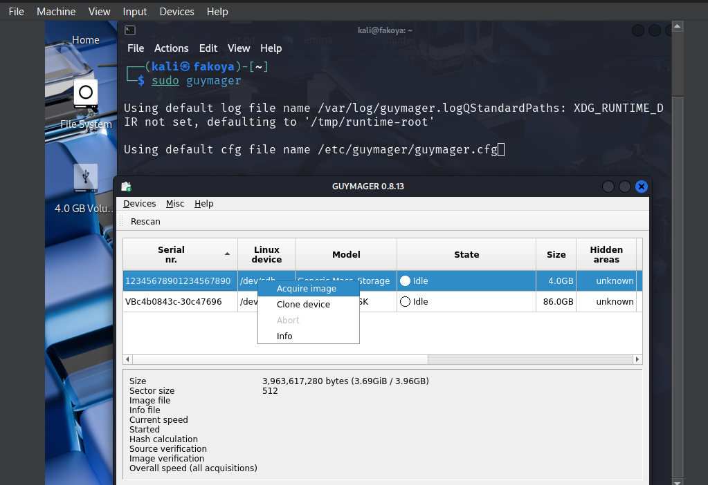
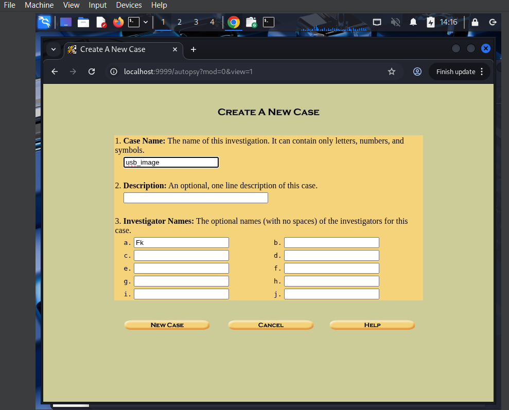
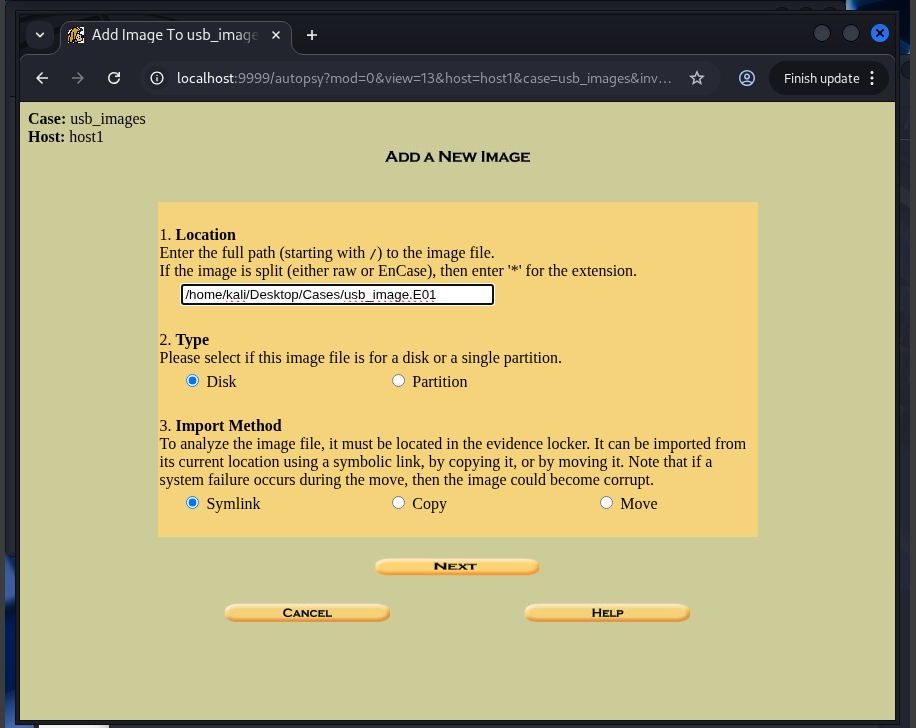
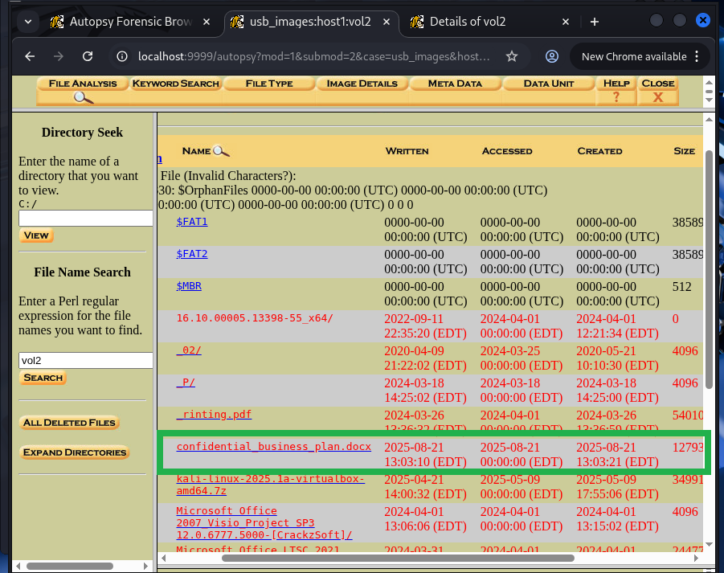
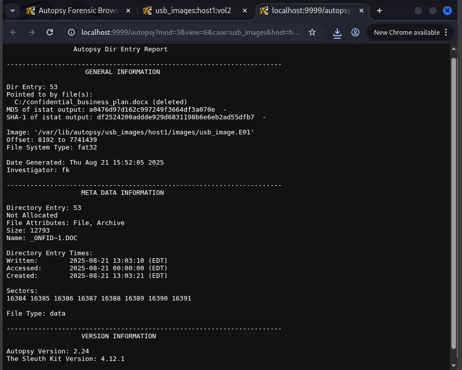
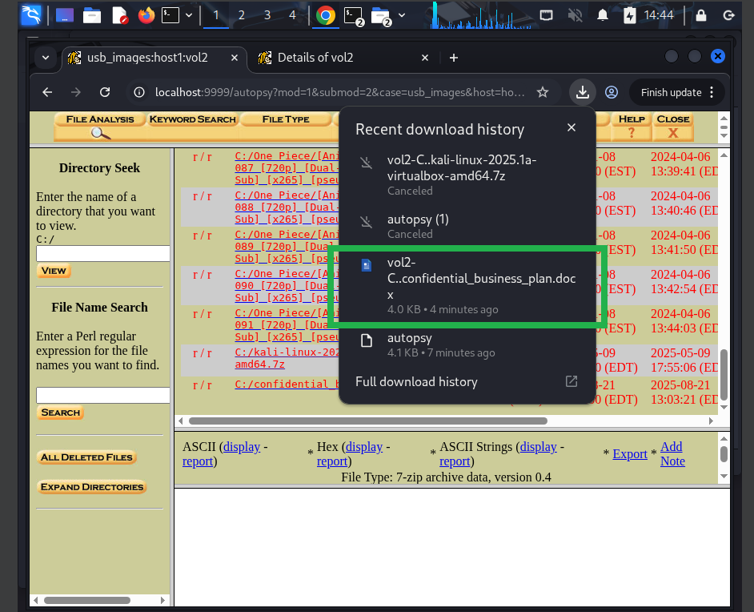

# Project: Digital Forensics Investigation with Guymager & Autopsy

## Overview
This project demonstrates a comprehensive digital forensics investigation workflow using industry-standard tools to acquire, analyze, and preserve digital evidence from a storage device. The implementation covers forensic imaging, data recovery, and evidence analysis following proper forensic procedures. It would done using Kali Linux forensic workstation and a physical or virtual storage device.

---

## Organizational Application

### Importance to Companies
Digital forensics capabilities are critical for organizations to investigate security incidents, intellectual property theft, employee misconduct, and compliance violations. Proper evidence handling ensures legal admissibility and supports disciplinary actions or legal proceedings.

### Use Case Scenario
A company suspects an employee of stealing confidential business plans and transferring them via USB storage. The forensic investigation involves:
- Creating a forensic image of the suspect USB device
- Analyzing file system metadata and timestamps
- Recovering deleted files and artifacts
- Generating forensic reports for legal documentation
- Preserving chain of custody for evidence integrity

### Compliance Benefits
- **Legal Readiness**: Properly acquired evidence admissible in court
- **Incident Response**: Rapid investigation of security breaches
- **Data Recovery**: Retrieval of critical business documents
- **Regulatory Compliance**: Meeting data protection and investigation requirements

---

## Configuration & Screenshots

### 1. Virtual Machine Configuration
- Configured Kali Linux forensic workstation
- Set up USB controller settings for device access
- Prepared storage for evidence preservation


*Virtual machine settings for forensic workstation*

### 2. Forensic Tool Installation
- Installed comprehensive forensic toolkit
- Prepared environment for evidence acquisition
- Verified tool functionality and dependencies


*Forensic software installation and verification*

### 3. Device Discovery and Identification
- Identconnected storage devices using lsblk
- Verified device properties and storage capacity
- Prepared for forensic imaging process


*Storage device identification and verification*

### 4. Guymager Forensic Imaging
- Configured forensic image acquisition settings
- Set up hash verification for evidence integrity
- Selected appropriate image format (EWF)


*Forensic imaging configuration and settings*

### 5. Forensic Image Acquisition
- Executed bit-for-bit image acquisition
- Monitored imaging progress and verification
- Maintained evidence integrity throughout process


*Live forensic imaging process with verification*

### 6. Autopsy Forensic Browser Setup
- Launched Autopsy digital forensics platform
- Configured case management system
- Prepared for evidence analysis


*Autopsy forensic browser initialization*

### 7. Case Creation and Management
- Established new forensic case
- Documented investigator information
- Configured case metadata and tracking


*Forensic case creation and documentation*

### 8. Evidence Import and Processing
- Imported forensic image into analysis platform
- Configured evidence handling parameters
- Initiated automated evidence processing


*Forensic evidence import and configuration*

### 9. File System Analysis
- Conducted comprehensive file system examination
- Identified partitions and storage structures
- Prepared for detailed evidence analysis


*File system structure examination*

### 10. Evidence Examination and Recovery
- Performed file carving and recovery
- Analyzed file metadata and timestamps
- Identified relevant evidence artifacts


*Detailed evidence analysis and recovery*

### 11. Deleted File Recovery
- Recovered deleted confidential documents
- Extracted metadata and creation details
- Documented evidence recovery process


*Deleted file recovery and metadata analysis*

### 12. Forensic Reporting
- Generated comprehensive forensic reports
- Documented evidence chain of custody
- Prepared findings for legal proceedings


*Forensic report generation and documentation*

---

## Observations and Challenges

### Technical Challenges
- **Storage Requirements**: Large evidence images requiring significant storage space
- **Processing Time**: Lengthy analysis times for comprehensive examination

### Forensic Considerations
- **Chain of Custody**: Proper documentation of evidence handling
- **Legal Standards**: Adherence to forensic best practices for court admissibility
- **Evidence Preservation**: Preventing evidence alteration during analysis
- **Documentation**: Comprehensive case notes and reporting requirements

### Operational Challenges
- **Resource Intensive**: High CPU and memory requirements for analysis
- **Storage Management**: Efficient evidence storage and archiving
- **Tool Proficiency**: Required expertise in multiple forensic applications
- **Time Constraints**: Balancing thoroughness with investigation timelines

---

## Reflections

### Technical Learnings
- **Forensic Imaging**: Learnt to identify and analyze forensic imaging artifacts
- **Evidence Analysis**: Developed skills in file system examination and artifact recovery
- **Data Recovery**: Enhanced abilities in deleted file and metadata recovery

### Investigative Insights
- **Evidence Correlation**: Learned to correlate multiple evidence sources
- **Reporting Skills**: Enhanced forensic documentation and reporting capabilities

### Professional Development
- **Legal Awareness**: Understanding of evidence admissibility requirements
- **Ethical Considerations**: Importance of impartial and thorough investigations
- **Quality Assurance**: Implementation of verification and validation processes
- **Continuous Learning**: Need for ongoing training in evolving digital forensics

---

## How to Reproduce

### Prerequisites
- Kali Linux forensic workstation
- Physical or virtual storage device for analysis
- Minimum 8GB RAM, 100GB free storage
- Administrative privileges for forensic tools

### Implementation Steps

1. **Environment Preparation**
```bash
# Update system and install forensic tools
sudo apt update
sudo apt install autopsy guymager sleuthkit binwalk dc3dd -y
```

2. **Device Identification**
```bash
# List available storage devices
lsblk
```

3. **Forensic Imaging**
```bash
# Launch Guymager for forensic imaging
sudo guymager

# Configure imaging parameters:
# - Select EWF format for evidence preservation
# - Enable MD5, SHA-1, and SHA-256 hashing
# - Set appropriate case metadata
```

4. **Autopsy Case Setup**
```bash
# Launch Autopsy forensic browser
sudo autopsy

# Access web interface: http://localhost:9999/autopsy
```

5. **Case Creation**
```bash
# Create new forensic case with:
# - Case name and description
# - Investigator information
# - Appropriate case metadata
```

6. **Evidence Import**
```bash
# Import forensic image with parameters:
# - Image path: /path/to/forensic/image.E01
# - Import method: Symlink for integrity
# - File system type: Automatic detection
```

7. **Analysis Execution**
```bash
# Perform comprehensive analysis including:
# - File system examination
# - Deleted file recovery
# - Metadata extraction
# - Timeline analysis
```

8. **Evidence Examination**
```bash
# Conduct detailed evidence review:
# - File content analysis
# - Hash verification
# - Artifact correlation
# - Evidence documentation
```

9. **Report Generation**
```bash
# Generate forensic report with:
# - Executive summary
# - Detailed findings
# - Evidence documentation
# - Expert conclusions
```
